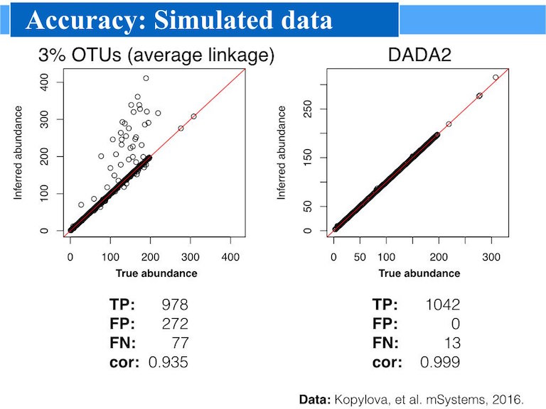

&nbsp;
<center>

</center>

--------------------------

## Fast and accurate sample inference from amplicon data with single-nucleotide resolution

--------------------------

####**<span style="color:red">DADA2 1.10 release is now live, and includes support for PacBio long reads! See [the release notes](ReleaseNotes_1_10.html).</span>**

&nbsp;

## Installation

Binaries for the current release version of DADA2 (1.10) are available from Bioconductor. Note that you must have R 3.5.0 or newer, and [Biocondcutor version 3.8](https://www.bioconductor.org/install/), to install the current release from Bioconductor.

```S
if (!requireNamespace("BiocManager", quietly = TRUE))
    install.packages("BiocManager")
BiocManager::install("dada2", version = "3.8")
```

If you wish to install the latest and greatest development version, or to install to earlier versions of R, see our [from-source installation instructions](dada-installation.html).

&nbsp;

## Tutorials

**<span style="color:red">Start here:</span>** The [DADA2 tutorial](tutorial.html) goes through a typical workflow for paired end Illumina Miseq data: raw amplicon sequencing data is processed into the table of exact **amplicon sequence variants (ASVs)** present in each sample.

The [DADA2 Workflow on Big Data](bigdata.html) goes through workflow optimized to run on large datasets (10s of millions to billions of reads).

An [ITS-specific version of the DADA2 workflow](ITS_workflow.html) identifies and verifiably removes primers on both ends of each ITS read, a key step due to the variable length of the ITS region.

Short demonstrations of [assigning taxonomy](assign.html) and [assigning species](assign.html) to sequences.

&nbsp;

## Benchmarking

Our [manuscript introducing DADA2](http://dx.doi.org/10.1038/nmeth.3869) ([OA link](https://www.ncbi.nlm.nih.gov/pmc/articles/PMC4927377/)) compares the accuracy of DADA2 and other methods on several mock community datasets. 

We describe [the broad advantages of exact sequence variants over OTUs in our recent open-access ISMEJ paper](http://dx.doi.org/10.1038/ismej.2017.119).

We evaluate [the high accuracy and resolution that is achievable by sequencing the full-length 16S rRNA gene with PacBio and DADA2](https://www.biorxiv.org/content/early/2018/08/15/392332).

Further [benchmarking of DADA2 against the methods evaluated in a recent QIIME1 benchmarking paper](SotA.html) is available.

And sometimes a picture says a thousand word:



&nbsp;

## Advantages

* **Resolution**: DADA2 infers exact amplicon sequence variants (ASVs) from amplicon data, resolving biological differences of even 1 or 2 nucleotides.
  
* **Accuracy**: DADA2 reports fewer false positive sequence variants than other methods report false OTUs.

* **Comparability**: The ASVs output by DADA2 can be directly compared between studies, without the need to reprocess the pooled data.
  
* **Computational Scaling**: The compute time of DADA2 scales linearly sample number, and memory requirements are essentially flat.

* **Open Source**: DADA2 is licensed under the [LGPL version 3](http://www.gnu.org/licenses/lgpl-3.0.en.html).

&nbsp;

## Support and Development

Planned feature improvements are publicly catalogued at the main DADA2 development site on github; specifically on the [issues tracker for DADA2](https://github.com/benjjneb/dada2/issues). If the feature you are hoping for is not listed, you are welcome to add it as a feature request on this page.

Bug reports and problems using DADA2 are also welcome on [the issues tracker](https://github.com/benjjneb/dada2/issues). We prefer posting to the issue tracker over email as these posts are searchable by other users who may experience the same problems.

&nbsp;

## How?

**Accuracy:** DADA2's crucial advantage is that it uses more of the data. The DADA2 error model incorporates quality information, which is ignored by all other methods after filtering. The DADA2 error model incorporates quantitative abundances, whereas most other methods use abundance ranks if they use abundance at all. The DADA2 error model identifies the differences between sequences, eg. A->C, whereas other methods merely count the mismatches. DADA2 can parameterize its error model from the data itself, rather than relying on previous datasets that may or may not reflect the PCR and sequencing protocols used in your study.

**Performance:** DADA2's computational scaling gains come from the fact that it infers sequences exactly rather than constructing OTUs. De novo OTUs cannot be compared across samples unless all samples were pooled during OTU construction. However, [exact sequences **are** comparable across samples, as exact sequences are consistent labels](http://dx.doi.org/10.1038/ismej.2017.119). Thus DADA2 can analyze each sample independently, resulting in linear scaling with sample number and trivial parallelization.
