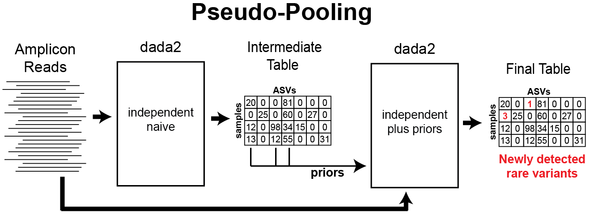

## Short Version

You can now tell the DADA2 method about "prior" sequence variants that you expect might be present. This increases sensitivity to those sequences and allows detection of singletons, without an increase in spurious output. The "priors" feature enables a new "pseudo-pooling" mode that gives results similar to fully pooling all samples, while maintaining linear-scaling of processing time with sampe number.

## Preamble

The core DADA2 denoising method attempts to provide the most accurate possible reconstruction of the exact amplicon sequence variants (ASVs) truly present in a sample from the noisy amplicon sequencing reads. This task can be thought of as consisting of two parts: (1) Classification of reads as error-free or not, and (2) mapping of error-containing reads to the appropriate error-free ASV.

As in any classification problem, achieving high accuracy in DADA2 requires both high sensitivity (i.e. reporting as many real ASVs as possible) and specificity (i.e. not reporting out spurious amplicon errors). Also as in any classification problem, after the advances from improved approaches and using more data are exhausted, a balance must be struck between sensitivity and specificity.

In DADA2 this balance manifests itself primarily in two ways. First, the `OMEGA_A` parameter sets the level of "statistical evidence" (think p-value) required for inferences of a new ASV, and is set at `OMEGA_A=1e-40` by default. Second, the p-values calculated by dada2 are conditional on that sequence being present in the dataset, which effectively "doesn't count" the first read from each unique sequence. This approach increases the accuracy of DADA2 by reducing the number of spurious ASVs output (i.e. increasing the specificity) which is often one of the most notable features for users transitioning to DADA2 from older OTU methods that were plagued by very high false-positive rates (e.g. [hundreds or thousands of OTUs from mock communities with tens of bacterial strains](https://peerj.com/articles/3889/)).

However, the tradeoff for that high specificity is that sensitivity, in particular to very rare variants, is somewhat reduced by the relatively conservative default `OMEGA_A` threshold, and singletons are not detected at all. This is often the right tradeoff (although changing `OMEGA_A` to get higher sensitivity when desired is a greatly underused feature in practice) because of the massive numbers of spurious sequences generated by amplicon sequencing. But could we do a bit better by incorporating a little prior inforomation into the de novo `dada` method?

# Priors

Priors are a set of sequences that the user expects might be present in their samples due to some prior knowledge, and are passed into the denoising method as the `dada(..., priors=my.prior.seqs)` argument. The basic concept is inspired by Bayesian priors in statistics. This is implemented in the DADA2 algorithm by requiring a lower level of statistical evidence for sequences that match the provided priors to be inferred as true ASVs (`OMEGA_P`, set to `OMEGA_P=1-e4` by default), and by calculating an unconditional p-value that does not effecitively ignore the first read (roughly similar to adding a pseudo-count to each unique sequence matching the priors).

The purpose of priors is to increase sensitivity to a restricted set of sequences, including singleton detection, without increasing false-positives from the unrestricted set of all possible amplicon sequences that must be considered by the naive algorithm. But let's see how it works in practice...

## Data setup and preliminaries

Load the dada2 library and turn on GAPLESS speedup:
```{r load-dada2, message=FALSE, warning=FALSE}
library(dada2); packageVersion("dada2")
library(ggplot2)
library(vegan)
theme_set(theme_bw())
```

*"The data we will analyze here are highly-overlapping Illumina Miseq 2×250 amplicon sequences from the V4 region of the 16S gene6. These 360 fecal samples were collected from 12 mice longitudinally over the first year of life, to investigate the development and stabilization of the murine microbiome7. These data are downloaded from the following location: http://www.mothur.org/MiSeqDevelopmentData/StabilityNoMetaG.tar."* This passage is excerpted from our F1000Research paper [Bioconductor Workflow for Microbiome Data Analysis: from raw reads to community analyses](https://f1000research.com/articles/5-1492/v2 in which we analyze the same dataset. If you wish to follow the rest of this document in R yourself, pause now to download the data from the above link and unpack it into the `~/full/` directory.

We now perform the standard data-processing preliminaries as in [the DADA2 Tutorial](https://benjjneb.github.io/dada2/tutorial.html): Visualize quality, filter and trim, learn error rates, dereplicate. Here we'll use just the forward reads from this paired-read dataset, in the interests of simplifying the presentation.

```{r prelims, results='hide', warning=FALSE}
# Get forward files and visualize quality profile
fnF <- list.files("~/full/", pattern="_R1", full.names = TRUE)
plotQualityProfile(fnF[c(3,13,33)])
# Filter and truncate to 240 based on quality profile
filtF <- file.path("~/full/filtered", basename(fnF))
track <- filterAndTrim(fnF, filtF, truncLen=240, maxEE=2, multithread=TRUE)
# Learn error rates
err <- learnErrors(filtF, multithread=TRUE, verbose=0)
plotErrors(err, nominalQ=TRUE) # sanity check
# Sanity check looks normal, so go ahead and read in dereplicatd sequences
drp <- derepFastq(filtF)
# Parse sample names out of filenames, and add to drp
sams <- sapply(strsplit(basename(fnF), "_"), `[`, 1)
names(drp) <- sams
```

## Using priors to increase sensitivity and detect singletons

First we run the naive `dada` denosing algorithm, in its standard fully de novo mode without prior information.

```{r dada-naive}
dd <- dada(drp, err=err, multithread=TRUE, verbose=0)
st <- removeBimeraDenovo(makeSequenceTable(dd), multithread=TRUE, verbose=TRUE)
```

Now we run the `dada` method again, but this time we tell it about an *E. coli* sequence we have some prior reason to believe might be present in these samples:
```{r dada-prior-ecoli}
sq.ec <- "TACGGAGGGTGCAAGCGTTAATCGGAATTACTGGGCGTAAAGCGCACGCAGGCGGTTTGTTAAGTCAGATGTGAAATCCCCGGGCTCAACCTGGGAACTGCATCTGATACTGGCAAGCTTGAGTCTCGTAGAGGGGGGTAGAATTCCAGGTGTAGCGGTGAAATGCGTAGAGATCTGGAGGAATACCGGTGGCGAAGGCGGCCCCCTGGACGAAGACTGACGCTCAGGTGCGAAAGCGTG"
dd.ec <- dada(drp, err=err, multithread=TRUE, priors = sq.ec, verbose=0)
st.ec <- removeBimeraDenovo(makeSequenceTable(dd.ec), multithread=TRUE, verbose=TRUE)
```

Compare the total set of ASVs inferred by each method:
```{r check-prior-ecoli}
identical(sort(getSequences(st)), sort(getSequences(st.ec))) # TRUE
```

They found the same set of ASVs as expected. 

Compare the number of samples in which the *E. coli* sequence was detected by both methods:
```{r more-ecoli}
c(naive=sum(st[,sq.ec]>0), prior=sum(st.ec[,sq.ec]>0))
```

There are more samples in which the *E. coli* sequence variant was detected when the prior was provided, as expected.

We plot the abundances of *E. coli* in each sample detected by naive `dada` and by `dada(..., priors=sq.ec)`:
```{r e-coli-prior, warning=FALSE}
df.ecoli <- data.frame(naive=st[,sq.ec], prior=st.ec[,sq.ec])
df.ecoli$prior.only <- df.ecoli$naive == 0 & df.ecoli$prior > 0
ggplot(data=df.ecoli, aes(x=naive, y=prior, color=prior.only)) + geom_jitter(alpha=0.5, width=0.2, height=0.2) +
  scale_color_manual(values=c("TRUE"="red", "FALSE"="black")) + guides(color=FALSE) + coord_fixed(ratio=1) +
  xlim(0,20) + ylim(0,20) + xlab("E.coli Reads (naive)") + ylab("E. coli reads (prior)")
```

As expected, the prior is allowing DADA2 to detect the *E. coli* ASV in samples where it is represented in just a few (1-4) reads and where the naive method failed to detect it (points in red). This includes detecting singletons! Outside of samples with those very low reads counts, all other reported *E. coli* abundances are identical between the methods. There was no price paid in specificity for this increase in *E. coli* sensitivity: the naive and prior methods output the same total set of ASVs, so there were no new false positives.

## Does it matter?

How much does this matter, really? In many cases, not much. The naive method does a very good job, and is returning identical results for every sample in which *E. coli* is supported by 5 or more reads (and in many supported by less). In practice, the naive method requires that there be at least 2 error-free reads of an ASV for it to be detected, while prior ASVs can be detected if present in just one error-free read. Those detection limits are not that different quantitatively.

However, when detection at very low levels is desired for known variants, setting the prior effectively reduces the detection limit to the lowest possible level (1 error free read) without sacrificing specificity. I've found this feature particularly useful when dealing with time-course datasets, especially when we are interested in certain bacterial species that are important to a health outcome but comprise only a minor part of the total community, such as infectious agents like *E. coli* and *Campylobacter* in the bovine GI tract.

The example here used a single sequence, but a much larger set of priors can be provided to the method, such as all ASVs detected in your pilot data or all known sequence variants from the Lactobacillus genus. Or, perhaps, datasets could generate their own priors...

# Pseudo-pooling

From [our documentation on pooling for sample inference](https://benjjneb.github.io/dada2/pool.html#pooling-for-sample-inference):

>De novo OTU methods must pool samples before processing them, as without pooling the labels between samples are not consistent and cannot be compared, i.e. OTU1 in sample 1 and OTU1 sample 2 won’t be the same. DADA2 resolves sequence variants exactly, and because DNA sequences are consistent labels samples can be processed independently and then combined (and this is the default behavior).
>
>Independent sample processing has two major advantages: Computation time is linear in the number of samples, and memory requirements are flat with the number of samples. However, pooling allows information to be shared across samples, which makes it easier to resolve rare variants that were seen just once or twice in one sample but many times across samples. Pooled sample inference is also supported by calling  dada(..., pool=TRUE).

The linear scaling of independent sample inference allows ASV methods like dada2 to be applied to almost arbitrarily large samples, with the most notable example perhaps being [the Earth Microbiome Project](https://www.nature.com/articles/nature24621) where the adoption of ASVs over OTUs reduced data processing time from months to about a week.

Is there a way to increase sensitivity to rare variants by sharing data across samples without losing the fast linear-scaling of computation time with dataset size? Our idea is to implement "pseudo-pooling", a two step process in which independent processing is performed twice: First on the raw data alone, and then on the raw data again but this time informed by priors generated from the first round of processing.



Pseudo-pooling with dada2 can be performed by hand using the `priors` argument, but an easy-to-use implementation is also provided with the `dada(..., pool="pseudo")` option. By default, all ASVs detected in at least two samples in the first sample processing step are input as priors to the second step, but that condition can be changed with the `PSEUDO_PREVALENCE` and `PSEUDO_ABUNDANCE` dada options.

## Profiling pseudo-pooling

Let's go ahead and run each mode of inference (independent: `pool=FALSE`, pseudo-pooling: `pool="pseudo"`, and pooled samples: `pool=TRUE`) on this dataset, and track the execution time of each.

```{r dada-pooling}
system.time(dd <- dada(drp, err=err, multithread=TRUE, pool=FALSE, verbose=0)) # default
system.time(dd.pseudo <- dada(drp, err=err, multithread=TRUE, pool="pseudo", verbose=0))
system.time(dd.pool <- dada(drp, err=err, multithread=TRUE, pool=TRUE, verbose=0))
```

As expected, pooled inference takes longer than independent processing, while pseudo-pooling is intermediate. In general, pseudo-pooling will take very close to twice the time of independent processing, as it is effectively running independent processing twice. Note that all processing modes are easily tractable on this data on a laptop. Full pooling is usually tractable on Miseq dataset sizes, and it is only for larger dataset sizes that the quadratic increase in computation time with total depth becomes too onerous.

Now let's compare the results from each mode:
```{r seqtab-pooling}
st <- removeBimeraDenovo(makeSequenceTable(dd), multithread=TRUE, verbose=TRUE)
st.pseudo <- removeBimeraDenovo(makeSequenceTable(dd.pseudo), multithread=TRUE, verbose=TRUE)
st.pool <- removeBimeraDenovo(makeSequenceTable(dd.pool), multithread=TRUE, verbose=TRUE)
```

Note the increasing numbers of chimeras identified by pooling! Chimeras and contaminants are often rare and spread across lots of samples, making them much more effectively detected when pooling samples.

Let's take a look at the number of observed ASVs in each sample for each processing mode:
```{r compare-pooled-richness, warning=FALSE}
nsam <- length(filtF)
df.obs <- data.frame(observed=c(rowSums(st>0), rowSums(st.pseudo>0), rowSums(st.pool>0)),
                     mode=rep(c("independent", "pseudo", "pooled"), each=nsam),
                     rank=rank(rowSums(st.pool>0)), times=3)
keep <- !grepl("Mock", sams) & rowSums(st)>1000
ggplot(data=df.obs, aes(x=rank, y=observed, color=mode)) + geom_point() +
  xlab("Samples") + ylab("Observed ASVs")
```

More ASVs are observed per-sample when pooling samples together, and pseudo-pooling is intermediate between independent and pooled processing, and a bit closer to the pooled per-sample observed ASV counts.

Now let's look how this plays out when looking at the total community distances between the same samples processed in the independent, pseudo-pooled and pooled modes. We'll do that by calculating Bray-curtis distances between samples processed in each mode, and then making "triangle" plots in a 2-D space that represent those distances, and where the pooled sample is fixed to lie at the origin (this is equivalent to a 2D PCoA ordination, which will exactly reconstruct the community distances when there are only 3 samples).

```{r plot-pooling-comparison}
# Give unique sample names to each mode
rownames(st) <- paste0(sams, ".ind")
rownames(st.pseudo) <- paste0(sams, ".pseudo")
rownames(st.pool) <- paste0(sams, ".pool")
# Merge into one big sequence table
sta <- mergeSequenceTables(st, st.pseudo, st.pool) # 
# Calculate distances
get.dists <- function(i, sta) {
  dists <- as(vegdist(sta[c(i,i+nsam,i+nsam+nsam),]), "matrix")
  c(ind.pseudo=dists[1,2], ind.pool=dists[1,3], pseudo.pool=dists[2,3])
}
dists <- as.data.frame(t(sapply(seq(nsam), get.dists, sta=sta)))
nonmetric <- apply(dists, 1, function(xx) max(xx) > 0.5*sum(xx)); sum(nonmetric) # 1
# Calculate MDS positions by hand, fixing the pooled point to lie at (0,0)
x.pool <- rep(0, nrow(dists)); y.pool <- rep(0, nrow(dists))
x.ind <- -dists$ind.pool; y.ind <- rep(0, nrow(dists))
# Trig
x.pseudo <- (-dists$ind.pool^2 + dists$ind.pseudo^2 - dists$pseudo.pool^2)/(2*dists$ind.pool)
y.pseudo <- sqrt(dists$pseudo.pool^2 - x.pseudo^2)
# Check our arithmetic
all.equal(sqrt(x.pseudo^2 + y.pseudo^2)[!nonmetric], dists$pseudo.pool[!nonmetric]) # TRUE
all.equal(sqrt((x.pseudo-x.ind)^2 + (y.pseudo-y.ind)^2)[!nonmetric], dists$ind.pseudo[!nonmetric]) # TRUE
# Make plotting data.frame
df <- data.frame(x = c(x.ind, x.pseudo, x.pool), y=c(y.ind, y.pseudo, y.pool),
                 mode=rep(c("independent", "pseudo", "pooled"), each=nsam), 
                 type="all", include="all", sample=c(sams, sams, sams),
                 stringsAsFactors=FALSE)
plotdf <- df[!grepl("Mock", sams) & rowSums(st)>1000,] # Recyling the values 3x here
# Randomly pick 3 example samples to plot separately
set.seed(100); NEX <- 3
examples <- sample(unique(plotdf$sample), NEX)
plotdf <- rbind(plotdf, plotdf[plotdf$sample %in% examples,])
example.rows <- seq(nrow(plotdf)-3*NEX+1,nrow(plotdf))
plotdf$type[example.rows] <- "single"
plotdf$include[example.rows] <- plotdf$sample[example.rows]
# Plot!
library(ggplot2)
ggplot(data=plotdf, aes(x=x, y=y, color=mode, alpha=type)) + geom_point() + 
  facet_grid(include~.) + scale_alpha_manual(values=c("all"=0.2, "single"=1)) +
  theme_bw() + coord_fixed(ratio=1) + guides(alpha=FALSE) + theme(panel.grid=element_blank()) +
  xlab("Distance (Bray-Curtis)") + ylab("Distance")
```

The closer the points in this plot are, the more similar the sample composition as inferred in these different modes was. This plot shows that samples inferred by pseudo-pooling are much more similar to samples inferred by full pooling than are samples inferred by independent sample processing, as was our goal!

## Pseudo-conclusions

Pseudo-pooling provides a computationally efficient and scalable method to approximate the results from full pooling in linear time. In many cases, especially when samples are repeatedly drawn from the same source such as in longitudinal experiments, pseudo-pooling can provide a more accurate description of ASVs at very low frequencies (e.g. present in 1-5 reads per sample). However, we note that independent sample inference is still very accurate, and is less prone to reporting certain types of false-positives, such as contaminants, that are present at very low frequencies across many samples and that the pooling mode tends to detect. So use what works for your study!